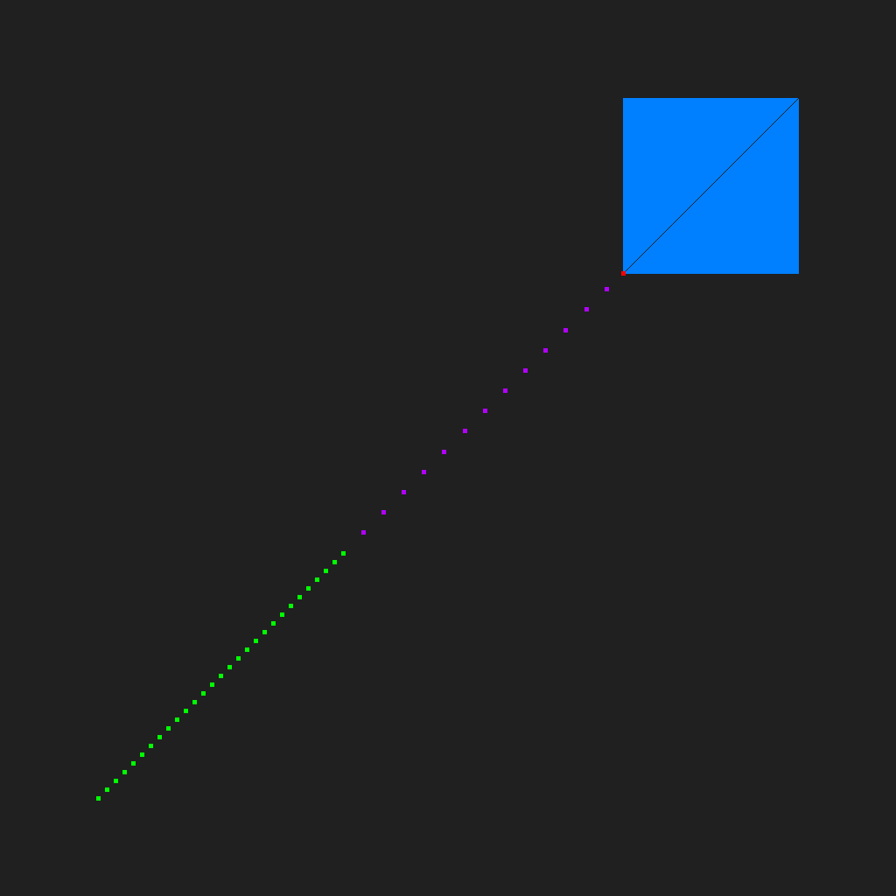
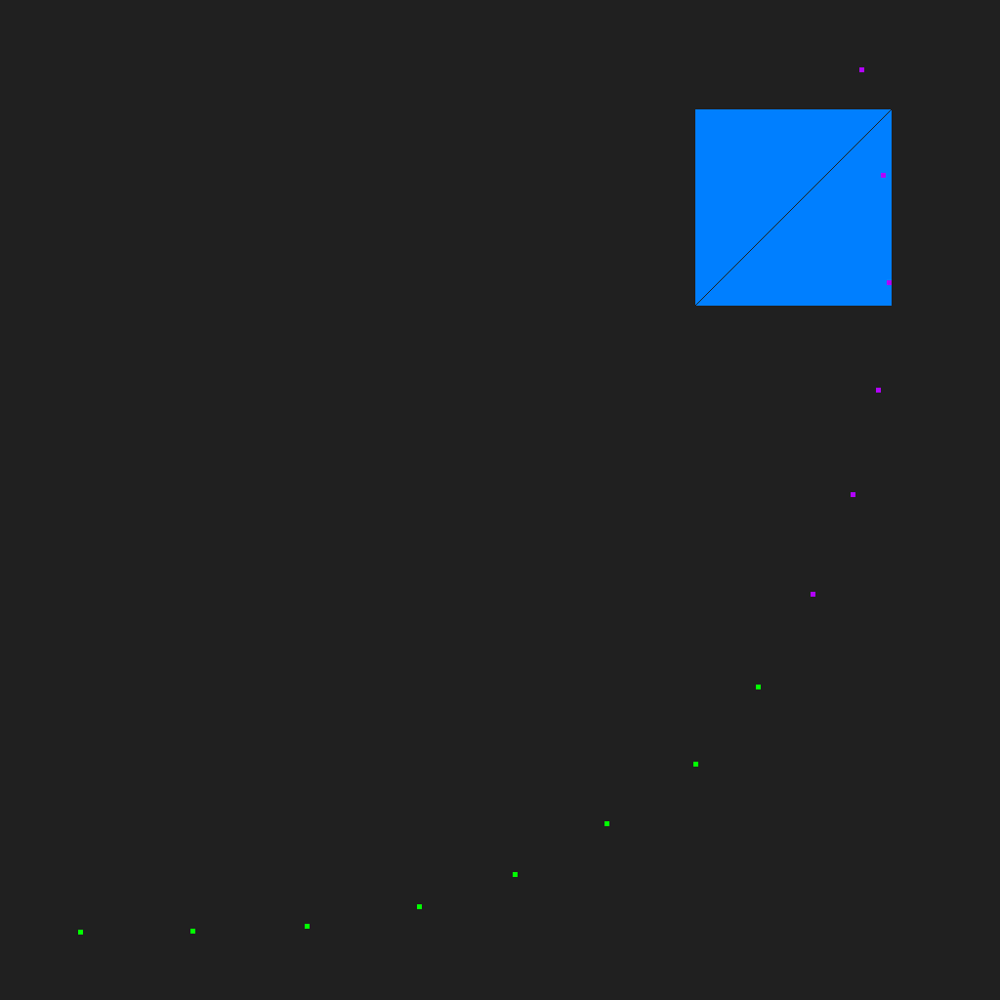

# track2d-demo

track2d-demo is an example of how track2d-lib could be used to estimate trajectory on a 2d plane





## Installation

Clone the project and run script `./scripts/demo_read_from_file.sh`

```bash
git clone https://github.com/ivanbugaiov/track2d-demo
cd track2d-demo
./scripts/demo_read_from_file.sh
```

## Usage

See `./scripts/demo_read_from_file.sh` for details on how to run demo with your data.

Rudimentary visualizer which is enabled by default kills what's left of performance and might lead to problems if custom data span is more than 512 along any of the axes. Disabling visualizer might help in this case, build without `-DWITH_TRACK_DISPLAY=On` to achieve that.

## Reading the code

If you are not familiar with the code, it is better to ignore `ppm_image*` and `track_display*` files and keywords - these are essentially debug tools. 

Start with `main.cpp` to get the general idea of how demo works. Perimeter intersection logic will be found in `polygon_perimeter.*` files, `file_plot_source.*` is a minimalistic implementation of the `track2d::IPlotSource` interface to allow estimator fetch data from file. 

## Known issues

* curving trajectory demo does not detect a collision
* perimeter will be drawn incorrectly in most cases

## Contributing

Pull requests are welcome. For major changes, please open an issue first
to discuss what you would like to change.

Please make sure to update tests as appropriate.

## License

[MIT](https://choosealicense.com/licenses/mit/)
